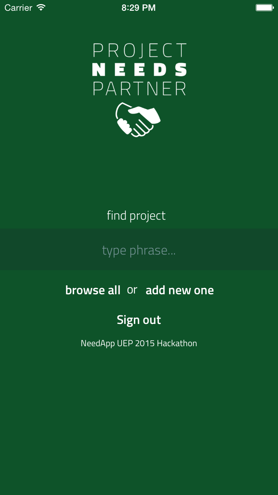
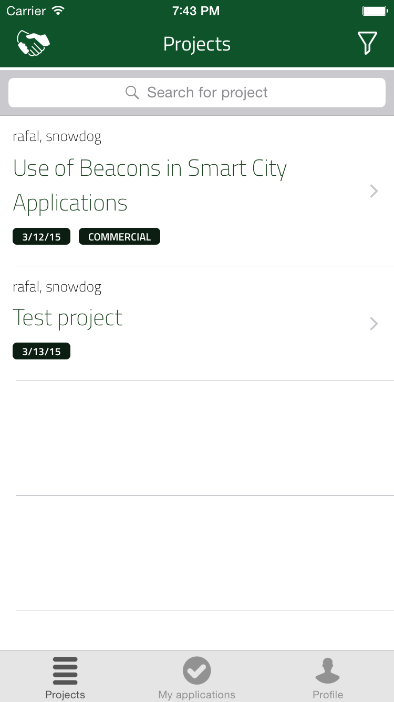
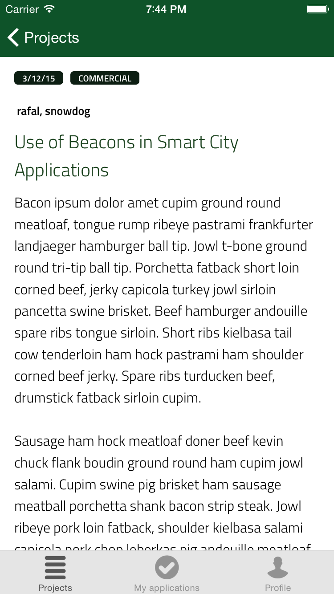
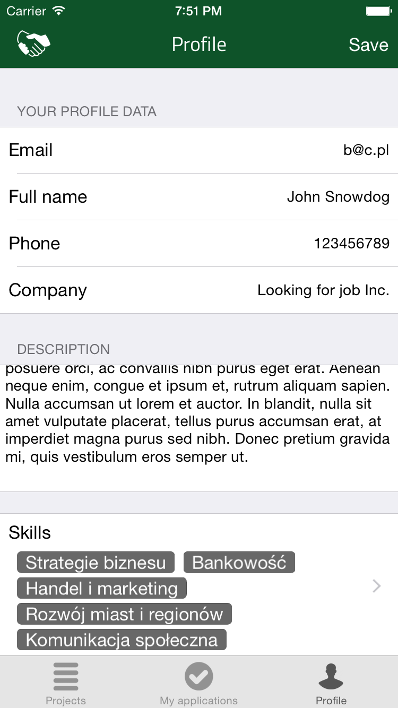
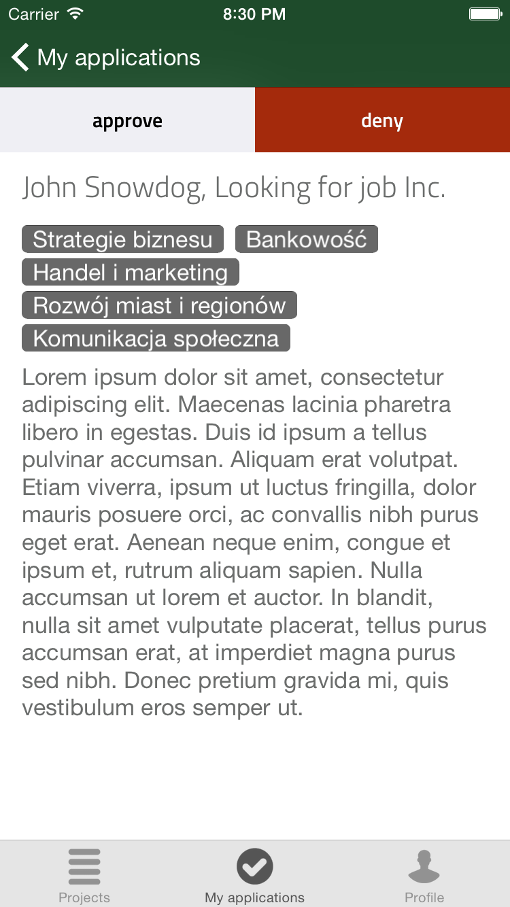

Project Needs Partner
=======

It's an iOS app that was created by Trail.pl team during NeedApp UEP 2015 Hackathon. Its main purpose is to enable  graduates to estabilish cooperation with other graduates, students, scientists and university partners. The application allows to create a project and specify job positions that are needed. You can select skills that are required for each job position. Then users can browse projects or search for them specifying custom filtering options. When they find it, they can apply for a job in chosen project. Author of the project may approve or reject the application. If the application is approved, app allows the author to contact with an applicant.

The app itself was created in Swift, but the backend is fully provided by Parse.com

## Screenshots:

